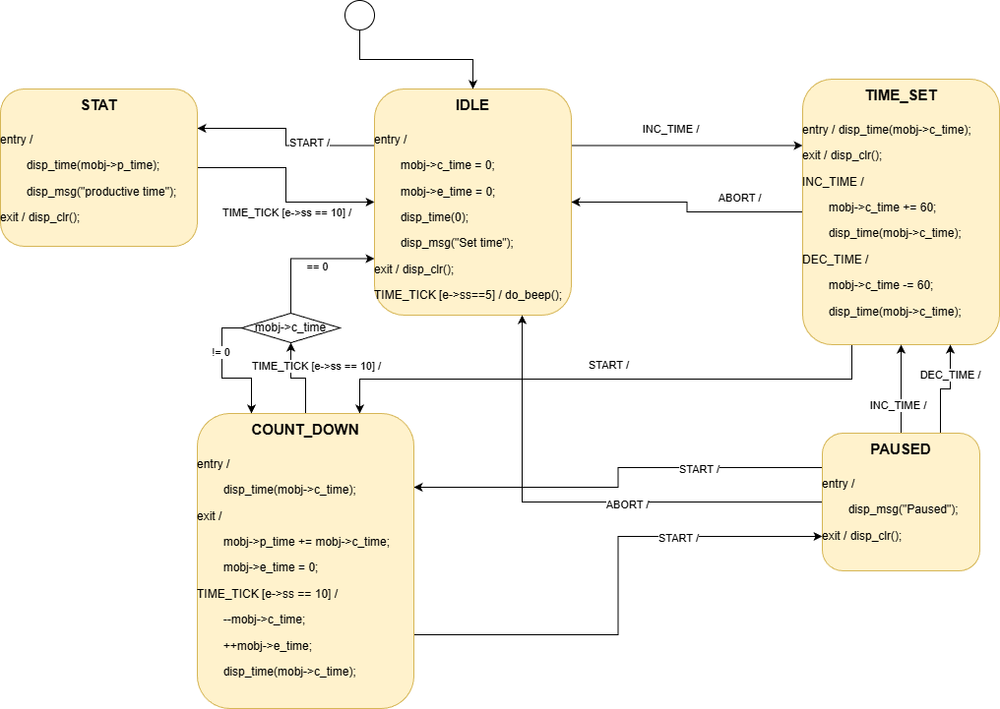

# Description

- Practice Adapter design pattern. 
- State machine using nested switch.
- Writing wrapper classes (Adapters).
- Signal debouncing.

# State Machine UML

# To do

## Code

`progress`  

- Refactor display to an interface that uses and adapter library (Ssd1306Adapter.cpp).
- Implement button input with debouncing.
- Fix SSD1306 Library implementaion.
  - Try implementing adapter as a class.
- Implement row clearing using `getBuffer()`.

`end progress`  

- Move Adapter library, Cp437 library to global for reusage.
  - https://community.platformio.org/t/lib-deps-creating-different-versions-of-included-file/46520
  - https://community.platformio.org/t/difficulties-understanding-the-right-way-to-include-local-libraries/46558

## Repo

`progress`  

- Fix UML diagram embed.
- Create README script.

`end progress`  

- Change UML fields to match code.
- Video demonstration.
- Write DOCS?.